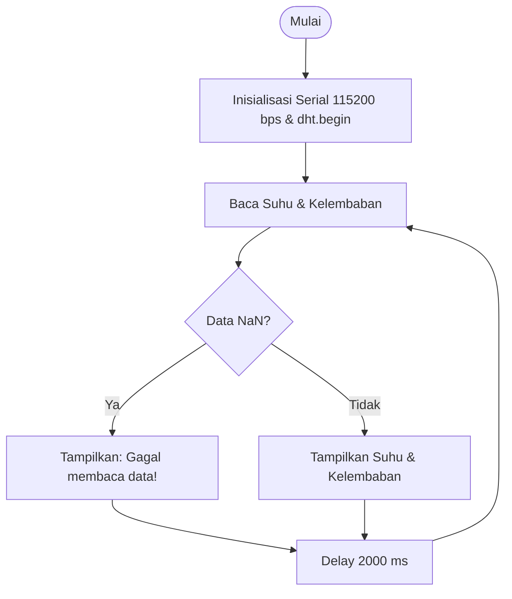

# Jawaban Pertanyaan Praktikum & Analisis Modul 1

---

## 1.5.4 Percobaan 1A: Akuisisi Data Sensor DHT22

### Pertanyaan 1

**Gambarkan diagram alur (flowchart) proses akuisisi data sensor DHT22 pada program di atas!**

**Jawaban:**



---

### Pertanyaan 2

**Apa fungsi dari perintah `isnan()` pada program tersebut?**

**Jawaban:**

Perintah `isnan()` (Is Not a Number) digunakan untuk mengecek apakah hasil pembacaan sensor menghasilkan nilai NaN atau tidak valid. Pemeriksaan ini membantu program menghindari pengolahan maupun penampilan data yang keliru, misalnya karena masalah koneksi kabel, kesalahan timing, atau sensor tidak memperoleh daya.

---

### Pertanyaan 3

**Jelaskan mengapa diperlukan jeda (delay) minimal sekitar 2 detik antar pembacaan sensor DHT22!**

**Jawaban:**

- **Karakteristik Hardware:** DHT22 mempunyai frekuensi sampling maksimum 0.5 Hz, sehingga pembaruan data dilakukan sekitar setiap 2 detik.
- **Mengurangi Self-Heating:** Pengambilan data secara terlalu cepat berpotensi menimbulkan pemanasan pada sensor dan dapat memengaruhi ketelitian pengukuran suhu.
- **Keandalan Komunikasi:** Jeda memberikan waktu yang cukup agar proses komunikasi digital sensor dapat berlangsung dengan baik dan stabil.

---

### Pertanyaan 4

**Modifikasi program agar data suhu dan kelembaban dirata-ratakan dari 5 kali pembacaan sebelum ditampilkan, dan berikan penjelasan di setiap baris kode yang ditambahkan dalam bentuk README.md!**

**Jawaban:**

#### Kode Program (`modul1_akuisisi_sensor_average.ino`)

```cpp
#include <DHT.h>

#define DHTPIN 4
#define DHTTYPE DHT22

DHT dht(DHTPIN, DHTTYPE);

void setup() {
  Serial.begin(115200);
  dht.begin();
  Serial.println("Memulai akuisisi data rata-rata DHT22...");
}

void loop() {
  float totalSuhu = 0.0;
  float totalKelembaban = 0.0;
  int validSamples = 0;

  for (int i = 0; i < 5; i++) {
    float tempSuhu = dht.readTemperature();
    float tempHum = dht.readHumidity();

    if (!isnan(tempSuhu) && !isnan(tempHum)) {
      totalSuhu += tempSuhu;
      totalKelembaban += tempHum;
      validSamples++;
    } else {
      Serial.println("Sampel ke-" + String(i + 1) + " gagal!");
    }
    delay(2000); // Delay wajib 2 detik antarsampel
  }

  if (validSamples > 0) {
    Serial.print("Suhu Rata-rata: ");
    Serial.print(totalSuhu / validSamples);
    Serial.print(" °C | Kelembaban Rata-rata: ");
    Serial.print(totalKelembaban / validSamples);
    Serial.println(" %");
  } else {
    Serial.println("Gagal mengambil data valid dalam 5 sampel!");
  }
}
```

#### Penjelasan Kode

| Baris Kode | Penjelasan |
|---|---|
| `float totalSuhu = 0.0;` & `float totalKelembaban = 0.0;` | Digunakan sebagai penampung total nilai suhu dan kelembaban dari sampel yang diperoleh. |
| `int validSamples = 0;` | Menyimpan jumlah sampel yang berhasil dibaca agar perhitungan rata-rata menggunakan jumlah data yang valid. |
| `for (int i = 0; i < 5; i++)` | Menjalankan proses pembacaan sensor sebanyak lima kali. |
| `if (!isnan(...))` | Memastikan hanya hasil pembacaan yang valid yang dimasukkan ke perhitungan. |
| `delay(2000);` | Memberikan interval 2 detik di antara pembacaan, sesuai kemampuan sampling sensor sebesar 0.5 Hz. |

---

## 1.6.4 Percobaan 2A: Kendali Aktuator Relay Berdasarkan Data Sensor

### Pertanyaan 1

**Mengapa diperlukan nilai ambang batas (threshold) dalam sistem kendali aktuator berbasis sensor?**

**Jawaban:**

Threshold digunakan sebagai batas keputusan yang menjadi dasar mikrokontroler dalam menerjemahkan perubahan nilai fisik atau data kontinu, seperti suhu, menjadi perintah digital berupa kondisi ON atau OFF pada aktuator.

---

### Pertanyaan 2

**Jelaskan apa yang akan terjadi apabila nilai suhu Threshold diturunkan menjadi sangat rendah, misalnya 20.0°C!**

**Jawaban:**

- **Aktuator Cenderung Selalu ON:** Pada kondisi suhu ruangan normal (25°C - 30°C), nilai suhu akan lebih besar daripada threshold sehingga kondisi tersebut terus bernilai TRUE.
- **Kontrol Menjadi Tidak Efektif:** Sistem kehilangan kemampuan untuk menyesuaikan kerja aktuator secara dinamis berdasarkan perubahan lingkungan.
- **Energi Lebih Boros:** Aktuator dapat terus bekerja sehingga konsumsi energi meningkat dan masa penggunaan komponen berpotensi menjadi lebih pendek.

---

### Pertanyaan 3

**Apa perbedaan antara kendali aktuator secara terus-menerus (kondisi tunggal) dengan kendali menggunakan histerisis (dua ambang batas)?**

**Jawaban:**

| Parameter | Kondisi Tunggal (Single Threshold) | Histerisis (Dual Threshold) |
|---|---|---|
| **Batas Logika** | Hanya menggunakan 1 titik batas (contoh: 30°C) | Menggunakan 2 batas, yaitu T_ON = 30°C dan T_OFF = 28°C |
| **Respon Sinyal** | Lebih mudah mengalami chattering karena relay dapat berubah ON/OFF ketika suhu berada di sekitar threshold | Lebih stabil karena terdapat area deadband yang menahan perubahan status |
| **Dampak Perangkat** | Pergantian kondisi yang terlalu sering dapat meningkatkan keausan mekanis relay | Perubahan status yang lebih terkendali dapat membantu memperpanjang masa kerja relay/aktuator |

---

### Pertanyaan 4

**Modifikasi program agar menggunakan dua ambang batas (histerisis), misalnya aktuator menyala pada suhu di atas 30°C dan baru mati pada suhu di bawah 28°C, dan berikan penjelasan di setiap baris kodenya dalam bentuk README.md!**

**Jawaban:**

#### Kode Program (`modul1_kendali_histerisis.ino`)

```cpp
#include <DHT.h>

#define DHTPIN 4
#define DHTTYPE DHT22
#define RELAYPIN 5

DHT dht(DHTPIN, DHTTYPE);

const float suhuON = 30.0;   // Ambang atas
const float suhuOFF = 28.0;  // Ambang bawah
bool statusAktuator = false;

void setup() {
  Serial.begin(115200);
  dht.begin();
  pinMode(RELAYPIN, OUTPUT);
  digitalWrite(RELAYPIN, LOW);
}

void loop() {
  float suhu = dht.readTemperature();

  if (!isnan(suhu)) {
    // Logika Histerisis
    if (suhu > suhuON) {
      statusAktuator = true;   // Nyalakan jika menembus batas atas
    } else if (suhu < suhuOFF) {
      statusAktuator = false;  // Matikan jika turun di bawah batas bawah
    }
    // Jika di antara 28 °C - 30 °C, statusAktuator TIDAK BERUBAH

    digitalWrite(RELAYPIN, statusAktuator ? HIGH : LOW);
    Serial.print("Suhu: "); Serial.print(suhu);
    Serial.print(" °C | Status Aktuator: ");
    Serial.println(statusAktuator ? "ON" : "OFF");
  } else {
    Serial.println("Gagal membaca sensor!");
  }

  delay(2000);
}
```

#### Penjelasan Kode

| Baris Kode | Penjelasan |
|---|---|
| `const float suhuON = 30.0;` & `const float suhuOFF = 28.0;` | Menetapkan suhu pemicu untuk menyalakan aktuator pada 30.0°C dan batas untuk mematikannya pada 28.0°C. |
| `bool statusAktuator = false;` | Menyimpan status aktuator yang sedang atau terakhir digunakan. |
| `if (suhu > suhuON)` & `else if (suhu < suhuOFF)` | Status aktuator hanya diperbarui ketika suhu melewati salah satu batas yang telah ditentukan. |
| Zona Histerisis (28°C ≤ suhu ≤ 30°C) | Status `statusAktuator` tetap mengikuti kondisi sebelumnya ketika suhu berada di antara kedua batas, sehingga perubahan ON/OFF yang terlalu cepat dapat dihindari. |

---

## 1.7 Pertanyaan Analisis

### Pertanyaan 1

**Uraikan hasil tugas pada praktikum yang telah dilakukan pada setiap percobaan!**

**Jawaban:**

- **Percobaan 1A:** Pembacaan suhu dan kelembaban menggunakan DHT22 oleh ESP32 dapat dilakukan secara berkala setiap 2 detik melalui GPIO 4. Pengecekan dengan `isnan()` digunakan untuk menangani hasil pembacaan yang mengalami kesalahan, termasuk ketika koneksi sensor bermasalah.
- **Percobaan 2A:** ESP32 dapat mengaktifkan relay/LED melalui GPIO 26 dengan kondisi HIGH ketika suhu melewati 30°C. Ketika suhu turun kembali di bawah batas yang ditentukan, keluaran berubah menjadi LOW.

---

### Pertanyaan 2

**Bagaimana pengaruh akurasi dan waktu tanggap (response time) sensor terhadap kecepatan reaksi aktuator pada sistem IoT?**

**Jawaban:**

- **Akurasi Sensor:** Berpengaruh langsung terhadap ketepatan keputusan sistem. Kesalahan pada hasil pengukuran dapat menyebabkan aktuator aktif atau nonaktif pada waktu yang kurang sesuai.
- **Waktu Tanggap (Response Time):** Mempengaruhi seberapa cepat sistem dapat memberikan respons setelah kondisi berubah. Sensor yang membutuhkan waktu pembacaan relatif lama, seperti DHT22 ≈ 2 detik, kurang sesuai untuk aplikasi kritis yang membutuhkan respons sangat cepat/militik.

---

### Pertanyaan 3

**Bagaimana cara kerja sistem dalam mengubah data sensor menjadi keputusan kendali aktuator (proses akuisisi hingga aktuasi)?**

**Jawaban:**


- **Transduksi:** DHT22 mengubah besaran fisik berupa suhu menjadi informasi yang dapat dikirim sebagai sinyal digital.
- **Akuisisi:** ESP32 mengambil data tersebut melalui GPIO 4 kemudian menyimpannya sebagai nilai numerik bertipe float.
- **Komputasi:** Mikrokontroler membandingkan nilai yang diperoleh dengan aturan kendali yang telah diprogram, misalnya `if (suhu > threshold)`.
- **Aktuasi:** Hasil keputusan dikirimkan sebagai sinyal HIGH atau LOW untuk mengatur kerja relay melalui GPIO 26.

---

### Pertanyaan 4

**Bagaimana kombinasi antara akuisisi data sensor dan kendali aktuator dapat digunakan untuk membangun sistem IoT yang responsif terhadap perubahan kondisi lingkungan, misalnya pada sistem smart farming atau smart home?**

**Jawaban:**

Penggabungan proses akuisisi data dengan pengendalian aktuator dapat menghasilkan sistem lingkar tertutup (Closed-Loop System), yaitu sistem yang mengambil keputusan berdasarkan kondisi yang terdeteksi oleh sensor:

- **Smart Farming (Greenhouse Otomatis):** Sensor digunakan untuk memantau kelembaban tanah dan suhu udara. Ketika tanah berada pada kondisi kering (< 30%) dan udara memiliki suhu tinggi (> 32°C), ESP32 dapat mengaktifkan pompa irigasi serta kipas exhaust sampai kelembaban mencapai kondisi normal (70%).
- **Smart Home (AC / Kontrol Iklim):** Sensor memantau keberadaan penghuni dan suhu ruangan. Apabila ruangan sedang digunakan dan suhu melebihi 26°C, AC/kipas dapat dinyalakan secara otomatis. Ketika ruangan tidak digunakan, perangkat dapat dimatikan untuk mengurangi penggunaan energi.
